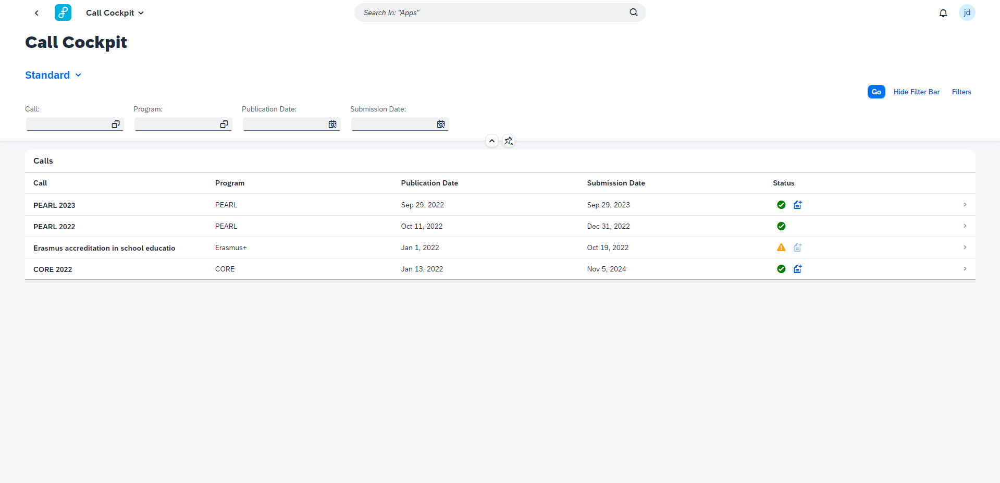
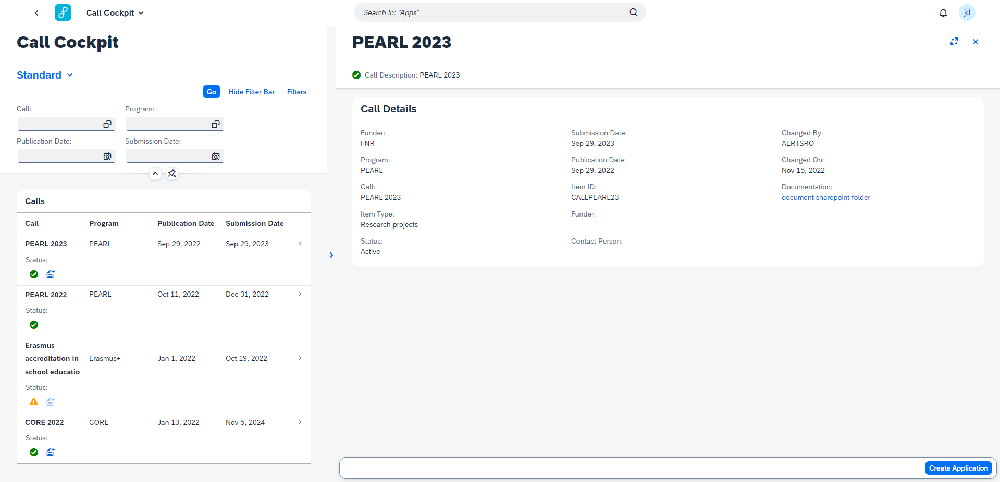

## Call Overview Page

The Call Overview Page is the first page the user lands on when opening the Call Cockpit. It provides an overview of calls assigned to the user's portfolion, with key information in the table columns. The 'Status' column indicates wether the call is active or not and if a form exists for the call. You can only start an application for a call when a form is assigned to it for the initial combination. The user can start an application by click on 

## Call Detail Page

By clicking on a call, the user can navigate to the Call Detail Page. This is where all information about a call can be consulted (deadlines, funder information, requirements, contacts,...). From the detail page the user can also start creating an application by clicking 'Start Application'

