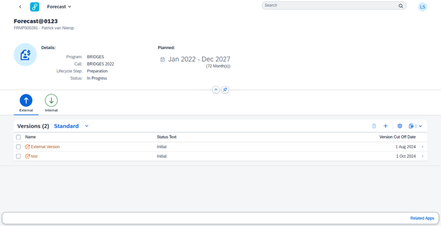

## General

The Forecast app empowers its users to generate accurate forecasts by integrating financial data, team member information, work package structures, and funder details. Users can conduct scenario analysis, validate forecasts, and visualize results to make informed decisions and optimize project resource allocation. With its intuitive interface and robust analysis capabilities, the app serves as a comprehensive tool for both internal project planning and external stakeholder communication.

Upon launching the application, you'll see item details reflected in the header section, followed by an external and internal tab displaying respective versions.

Each tab contains a multiselect table which allows you to select multiple versions at once if needed. When navigating from one tab to another the selection will be removed, so you can only select versions that are visible. 

It is possible to:
- Create a new version
>### _Important note:_
> Creating an internal forecast involves utilizing the app's integrated features within SAP PPM for tasks like adding team members, creating work packages, and accessing financial data. Conversely, generating an external forecast utilizes custom SAP z-tables (/FLEX/) for similar functionalities, tailored to meet external stakeholder requirements, ensuring flexibility and compatibility with the forecasting process.

A crucial parameter is the **cut-off date**, which determines historical actuals, year-to-date budget, and actuals calculations, facilitating accurate forecasting from this date onward. This cut-off date ensures that previous financial performance is appropriately considered while projecting future outcomes.

- Delete one or multiple versions at once, following certain conditions

Clicking on a version will navigate you to the corresponding application.

## Overview

| Object | Name | Purpose  |    
|:---|:---|:---|
| Gateway Service | /FLEX/FRMP_FORECAST_VERSION | Service for Forecast Version | 
| Table | /FLEX/FORECAST_H | Forecast Header information about version and related item | 
| Class | /FLEX/CL_FRMP_FORECAST_VERSION | Forecast Version Helper | 
| Class | /FLEX/CL_FRMP_FORECAST_VERSION_SH | Forecast Version Service Handler |

## Methods

#### Class /FLEX/CL_FRMP_FORECAST_VERSION
| Method | Purpose  |    
|:---|:---|
| CREATE_VERSION | Create a forecast version | 
| DELETE_VERSION | Delete a forecast version | 
| UPDATE_VERSION | Update a forecast version | 

