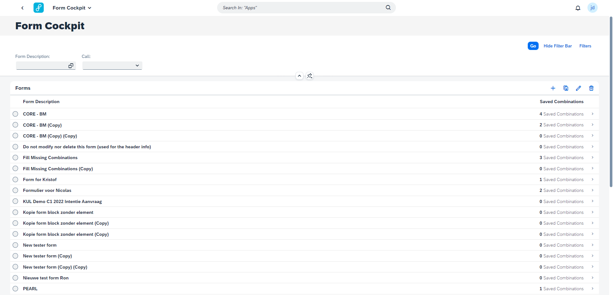
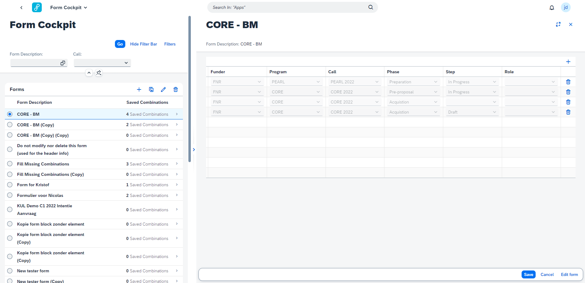
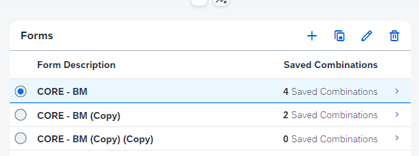
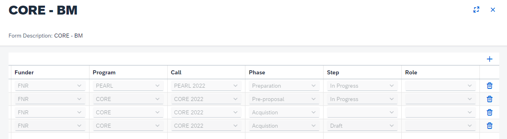

## Form Overview

A form is made for a specific point in the lifecycle (phase and step) of an item / research project (defined by a funder, program and call). This is further split up by the role of the user accessing the item (for example a principal investigator will have different options than a team member).

A form can exist for multiple combinations but not vice versa.

&nbsp;

The Form Cockpit provides an overview of all created forms. Different filters are provided so a form can be found easily. You can filter on the description of a form as well as on the call saved in a combination.

&nbsp;

&nbsp;

When clicking on a form the detail page will be opened. Here you can add or delete combinations for a form. Note that for a combination at least a Funder and a Call should be selected from the drop down menus. 

&nbsp;

## Form maintenance

# Create a Form

To create a new form you click the add icon located in the table toolbar on the master page (plus icon). You will now navigate to the form configurator where you can create the form. 

&nbsp;

# Copy a Form

To copy a form you first select the form in the table before clicking the copy icon in the table toolbar (copy icon). All form elements except the combinations will be copied to the new form. In the description “(Copy)” will be added at the end. The detail page of the newly created copy will open.

&nbsp;

# Edit a Form

To edit a form you first select the form in the table before clicking the edit icon in the table toolbar (pencil icon). You will now navigate to the Form Configurator where you can edit the selected form.

&nbsp;

# Delete a Form

To delete a form you first select the form in the table before clicking the delete icon in the table toolbar (bin icon). All references of the selected form will now be deleted and the form will be removed from the list. 

&nbsp;

## Form Combinations

A Combination indicates for what point in the lifecycle (phase and step) of an item / research project (defined by a funder, program and call) the form should be used. It is possible to add multiple combinations to a form.

A combination should at least contain a Program and Call. The form with the most specific combination will be used for the item / research project.

&nbsp;

# Add a Combination

To add a combination you click on the form for which you want to add a combination. The detail page containing all the combinations for the form will open. To add the combination you click the add icon in the table toolbar. A new line will be added to the table containing all the combinations. At least a Funder and Call should be selected as combination. 

&nbsp;

# Delete a Combination

To remove a combination you click on the form for which you want to remove a combination. The detail page containing all the combinations for the form will open. To remove the combination from the form you click the delete icon next to the combination you want to delete.

&nbsp;