Longtext component is a component that can be configured in the form configurator. A title can be configured as well as what SO10 text will be used to store the data. A SO10 text is identified by an objected as well as a textid. Both these id’s need to be entered in the form configurator.

&nbsp;
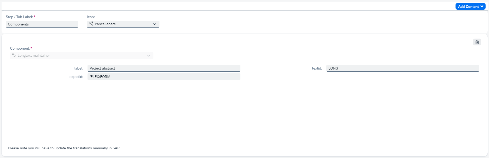
&nbsp;

The longtext maintainer can be added multiple times to a form because it can be configured in different ways. This is indicated with the settings icon next the components name in the component dropdown menu.

&nbsp;

&nbsp;

## Enter data

In the item app the component will display a text area where data will can be entered. On top of the component the configured label is visible. Data will be saved in the SO10 objectid and textid for the specific item.

&nbsp;
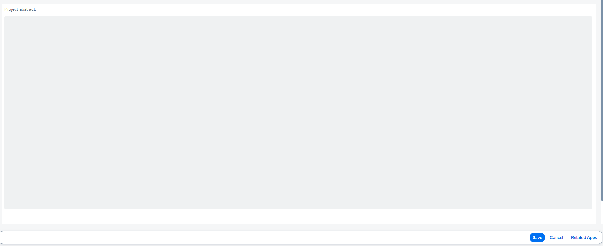
&nbsp;

## SO10 configuration

To store the longtext data a SO10 text needs to be created. To create a new SO10 text go tcode SE75, Choose the option Text Objects and IDs and choose change.

&nbsp;
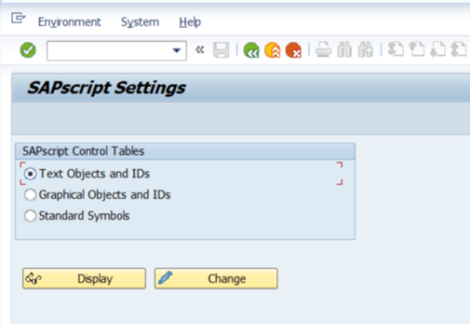
&nbsp;

A warning pop-up will display, changing text id’s is not client dependent, so any changes done will apply for all.

&nbsp;
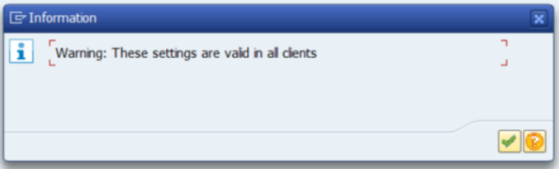
&nbsp;

A list of all currently available text object ID’s will be displayed. For the long texts these can all be found under the /FLEX/FORM object ID as noted in the description.

&nbsp;

&nbsp;

Double click on the entry to navigate to the list of text ID’s currently available for long texts.

&nbsp;

&nbsp;

To create a new text ID, press the new button. In the pop-up fill in the new text ID, with maximum of four characters and a corresponding description. Other fields can be left as is and click the green checkmark to save.

&nbsp;
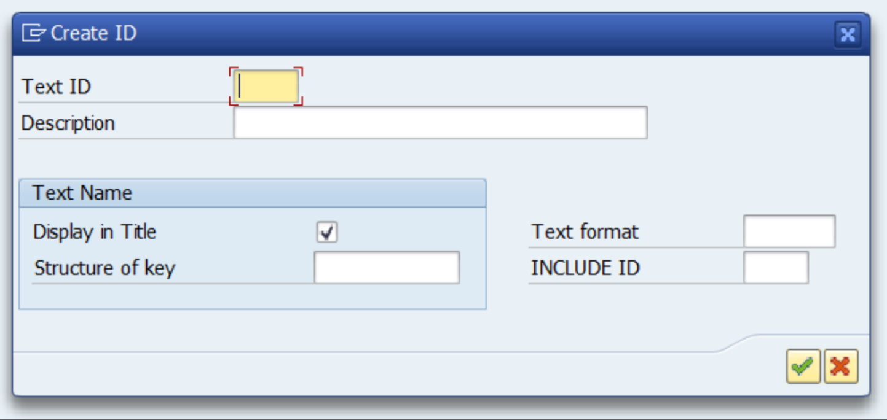
&nbsp;

Once saved it can be handy to note down the created text id and object id as you’ll need to enter this in the following step when configuring the component in the form configurator.

### Check where data is saved

You have created a text and want to check the text in the backend system. Currently there is no program to display the long texts. In order to check if a text exists, you can go to transaction SE16N and select table STXH. Fill in the text object and text id and execute.

&nbsp;
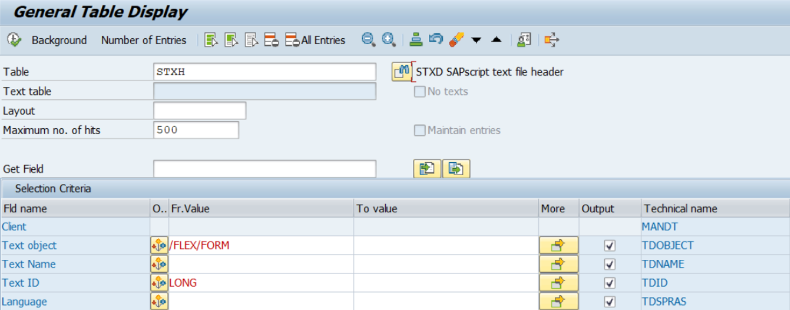
&nbsp;

In this table you can see when it was created/last changed and by whom, as well in which language text is maintained.

&nbsp;
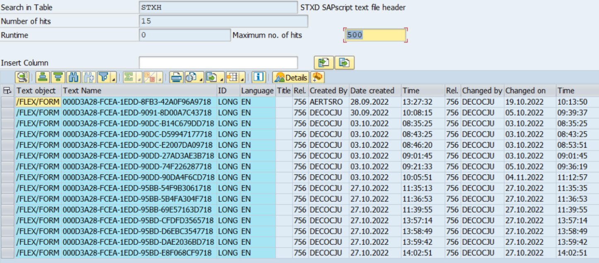
&nbsp;

To display the contents of a text you will need to go to transaction SE37. Fill in function module READ_TEXT and execute.

&nbsp;
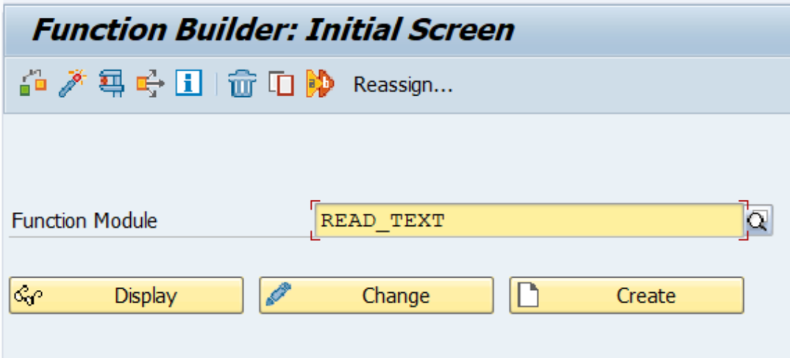
&nbsp;

To retrieve the contents fill in the parameters for the function call.

- Client: will be prefilled.
- ID: is the text id as defined in SE75
- Language in single character.
- Name: is the GUID as found in STXH
- Object: the object id as defined in SE75

And execute.

&nbsp;
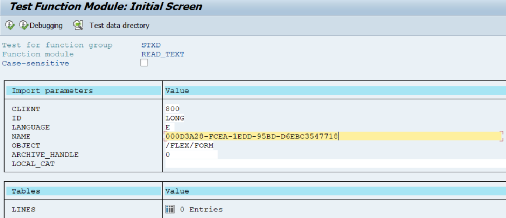
&nbsp;

The result will be shown, you will get some header information and under the Tables section you will have a result denoting the number of text lines contained in the SO10 (please note this can differ from the text entered on the form, SO10 has a character limit per line, so long texts are stored differently internally by using conversions to divide text in several lines according to this character limit). Click on the result lines to display the text.

&nbsp;
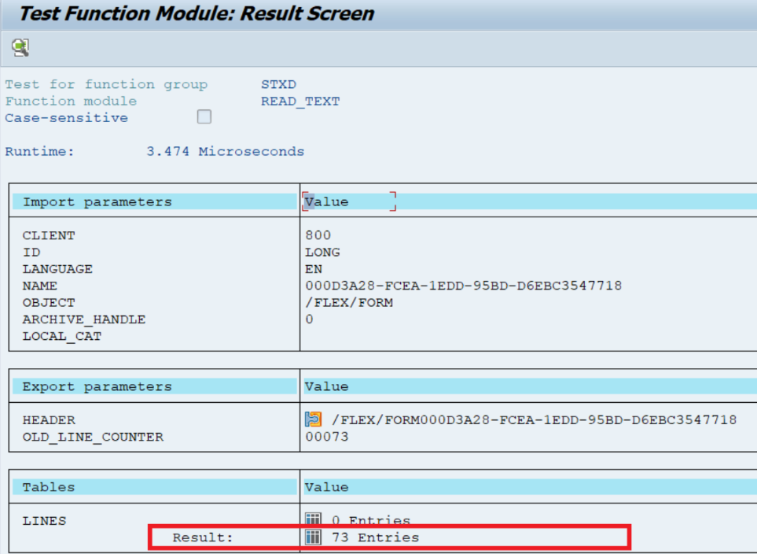
&nbsp;
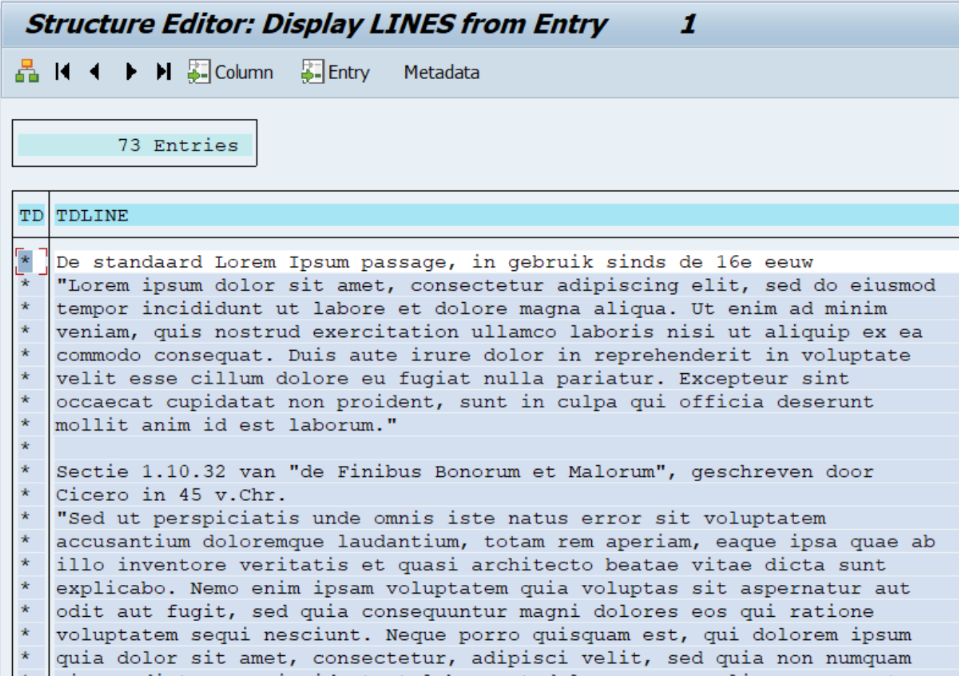
