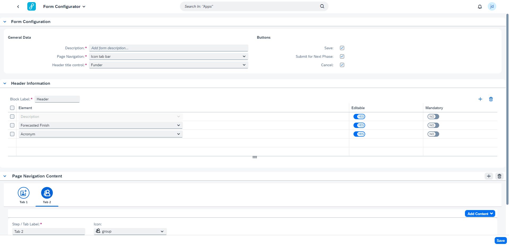

## Form Configurator

With the Form Configurator, the key user can generate different templates, and define at what point in the lifecycle of the research project these templates become relevant, and for which role. So, instead of having to create new applications, different templates can be created, maintained and assigned.

These templates will then become available in the Item Cockpit when the research project has the indicated decision point & phase (for the user with the correct role).

