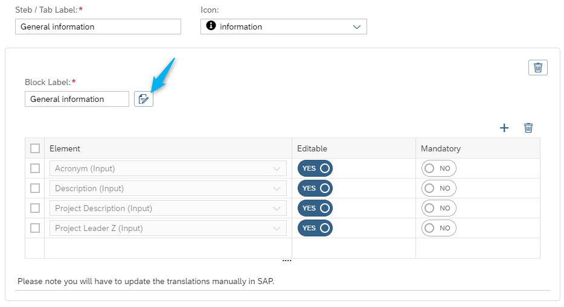
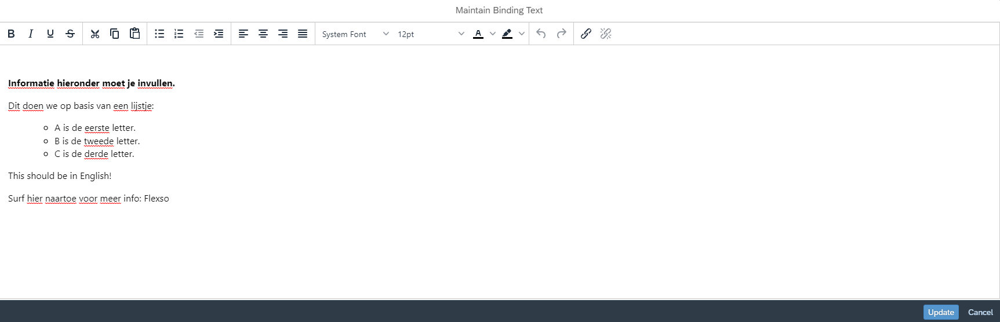

The following [feature flags](../General/Feature%20Flags) are supported:

- [Variant Management](../General/Feature%20Flags/variantmanagement.md)

## Binding Texts

_This feature allows the creation of desciptive (and formatted) texts at the top of a block_

**Only if this feature is enabled, the button to create a binding text will be visible:**

---

**In the popup window one can maintain a fully formatted text:**

---

Note: The text will be saved as an SO10 text (textid '/FLEX/BIND', objectid 'BIND') and if needed, translation can be done via the report /FLEX/TEXT_TRANSLATOR.

<!-- Move to Item App -->
<!-- ## Default header
_This feature allows the display of a default header block that will appear in every from._

**Only if this feature is enabled, the default header will be visible:**
  -->
