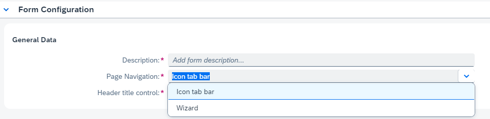
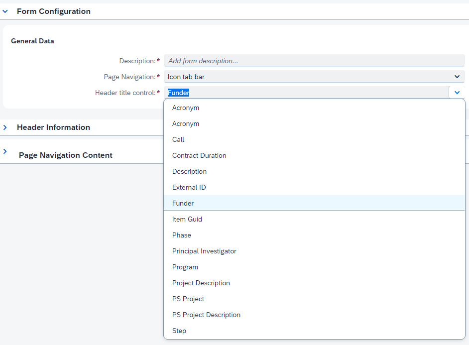
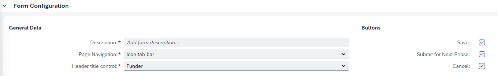
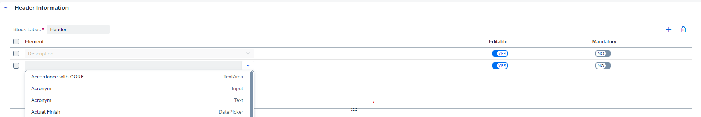
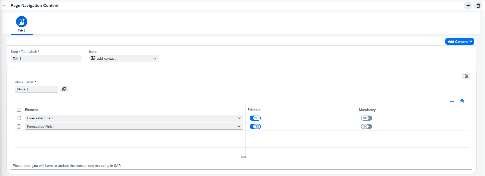
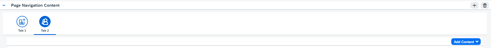
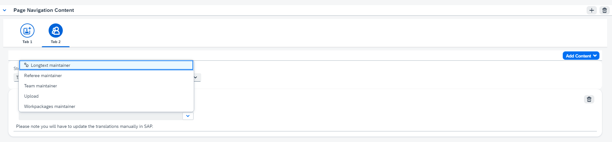
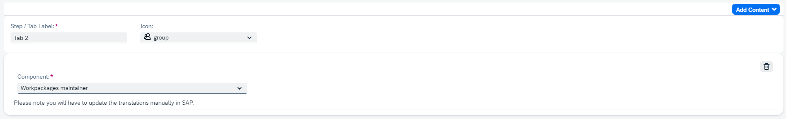
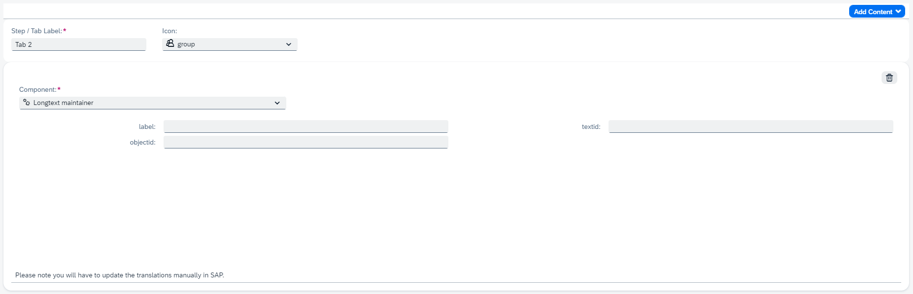

## Form Configuration

When starting the creation of a new form the key user must first specify some general configuration for the form in question.

The first one being a description for the form, since a large amount of forms will be created, it might help to be as descriptive as possible here.

The second option is the choice between using an [icon tab bar](https://experience.sap.com/fiori-design-web/icontabbar/) or a [wizard](https://experience.sap.com/fiori-design-web/wizard/) to order the multiple tabs/steps of the form. The main difference between the two of them is that the sequence between tabs/steps happens strictly linearly for the wizard ( first > second > third ) while the icon tab bar has no such restrictions.
Furthermore it is recommended to only use the wizard when dealing with between three and eight steps.

&nbsp;

&nbsp;

In the third dropdown you can select what field you want to display as the header title. It is only possible to select text or input controls.

&nbsp;

&nbsp;

The following option indicates which actions one wants to allow to use in the specific form. One might want a display-only mode while in other cases you might want to be able to save data but not progress the item to the next phase.

An item in this case refers to a PPM item, regardless of the specific stage it is in. So no distinction between application, award or project is made.

&nbsp;

&nbsp;

The 'Save' button makes it possible for users to save data they put into the form.

The 'Submit for Next Phase' button makes it possible for users to progress the item to the next phase as configured in PPM.

&nbsp;

## Header Information

<!-- Behind feature -->
<!--
Every form template contains a standard header which displays the name of the funder, program and call for which the form has been opened.

&nbsp;

&nbsp; -->

A key user can define fields to include in the header.
At the top a key user must assign a name to a block. The add button allows one to add extra fields to the block while the trashcan button allows one to delete selected fields.

In this context 'block' is used as grouping of fields (also called controls) which have a seperate subtitle.

&nbsp;

&nbsp;

When adding a new field, a user is given a dropdown list of all possible options - a name indicating what this field refers to, followed by the type of ui5 control this is represented as.

These fields are preconfigured in the backend, it is thus not possible to create completely new fields in this app or change the control type of existing ones (but new fields that are configured in the backend, can afterwards be added to a form).

It is however possible to specify whether or not a field is editable or mandatory. This is not possible in all cases however since a text control can never be made editable nor - subsequently - mandatory.

The order of the fields within a block can be changed through drag & drop.

One can delete one or multiple fields by selecting them in the list followed by pressing the 'delete' button.

## Page Navigation Content

The main content of a form is split up in several tabs - in case of an icon tab bar - or several steps - in case of a wizard - which represent seperate pages or sections of the form.

A step/tab is divided into several blocks (or components) which represent subsections of the form.

A form can have multiple steps/tabs and a step/tab can have multiple blocks.

&nbsp;

&nbsp;

Near the top of a step/tab one must assign a relevant name and one might assign a fitting ui5 icon as well.

Furthermore there are options to delete the step/tab that is currently selected or add content for this selected step/tab.

It is possible to change the internal order of the tabs/steps through drag & drop functionality.

&nbsp;

An end user can add new blocks through the 'Add Content' button, adding fields to the block works in the same way as it did for the header block.

The upper right button allows one to delete the selected block, furthermore it is also possible to change the relative order of the blocks through the same drag & drop functionality as previously mentioned.

&nbsp;

Apart from blocks it is also possible to add Components, these are best compared to smaller apps or widgets that are embedded within the form. They offer more complex functionalities and usually have a seperate way of saving their relevant data.

Examples are text editors, file uploaders and an app to manage work packages.

&nbsp;

&nbsp;

A key user can select one from the dropdown list. Some components are configurable, a configurable component is indicated by the settings icon next to the components name in the dropdown menu. A configurable component can be added multiple times to a form, other (non configurable component) can only be added once. Any changes to one of these components will have to be programmed in the component's app itself.

They can also be moved through drag & drop interchangeable with normal blocks.

&nbsp;

&nbsp;

&nbsp;
