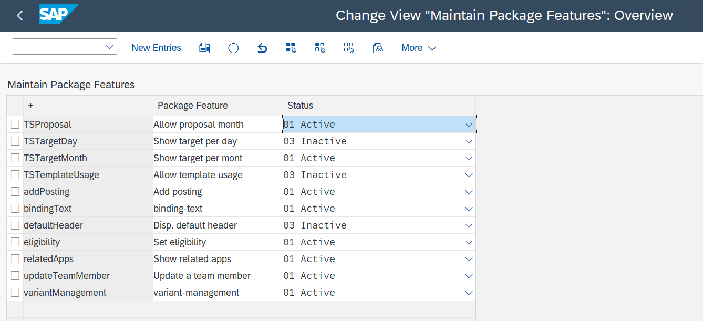
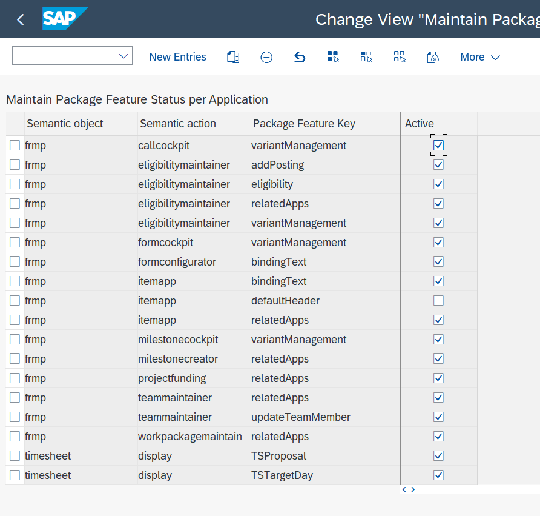

Some features can be 'turned on and off' in the FRMP package, depending if the customer wants to make use of them or not. We call them 'feature flags'. Some feature flags are app specific, they are explained in de documentation of the corresponding app. Other feature flags are general, and used in multiple apps. Here, we will explain you how to configure feature flags and how the general feature flags work.

## Configuration

To turn features flags on or off, navigate to: SPRO -> Flexso Research Management -> Features -> 'Maintain Package Feature'

Change the status of the feature flag to 'Active' or 'Inactive'.

For general feature flag, the flags can be turned on or off per app. Navigate to SPRO -> Flexso Research Management -> Features -> 'Maintain Package Feature Status per Applciation'

Make the feature flag (in)active for the respective app (semantic action) by (un)checking the box 'Active' or not.

