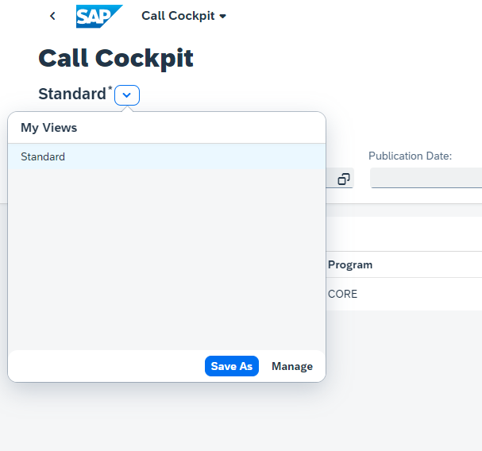
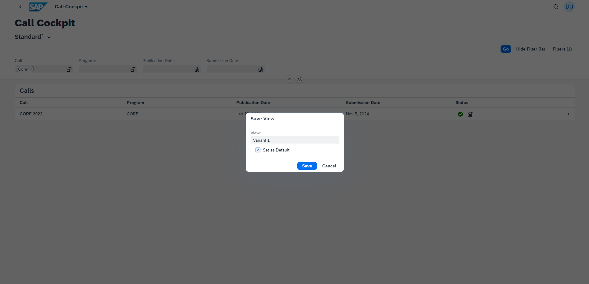
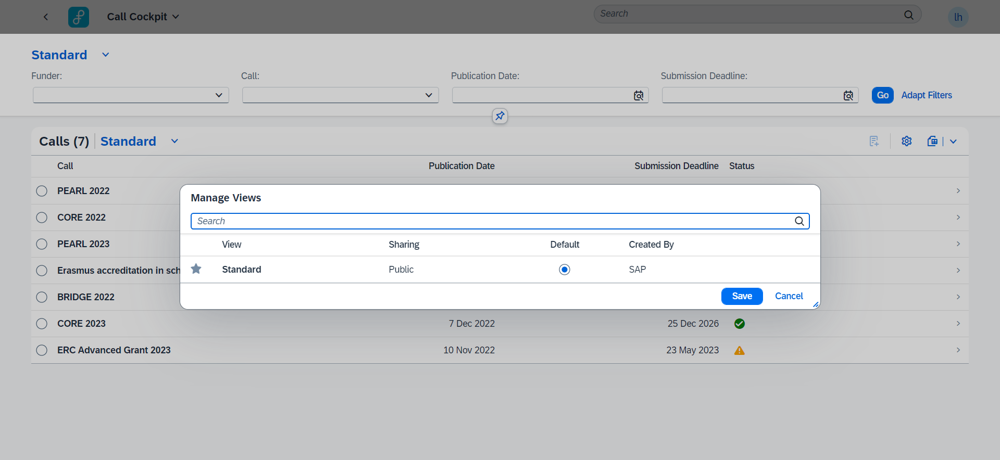

# Variant Management

## User Guide

Variant Management is a general feature flag, used in multiple apps. It makes it possible to save a filter or smart table configuration as a variant. This variant can be set as the standard variant, meaning it is the default variant you see when the app is opened.

By default, every user will start with the 'Standard' SAP provided variant. When changes were made to the filters, filter values have been set, or changes to the smart table were made (add or delete, sort, filter,...) an asterix appears in the top left corner of the filters or smart table. This to indicate that changes were made which can be saved into a variant.

To create this variant, click 'Save As' and provide a name for the variant.

 It is possible to manage created variants with the 'Manage' button. Manage options include picking favorites, setting as standard, deleting.

 

 ## Configuration

| Config Step | Value |
|---|---|
| Package feature key | variantManagement |
| Semantic object | frmp |
| Semantic action | callcockpit |
| | TBC |
