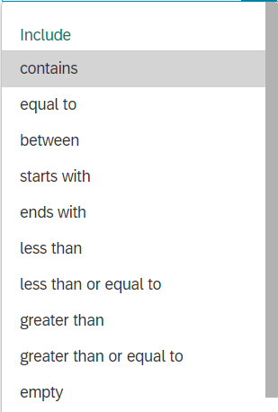
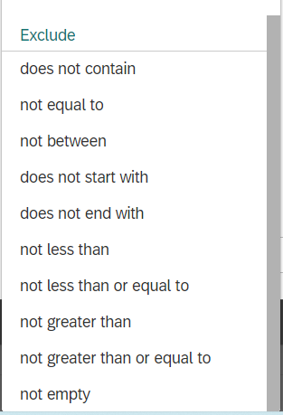
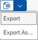

# Filtering and Smart Tables

## Filtering

Here it is explained how to use the filtering option.

### Using filters
1.	In the filters it is possible to include or exclude certain values in a flexible way; chose one or more opitons in the following list suiting your request:  

2.	Enter the information in the include and exclude selections that suites your request
3.	Click  

### Showing/hiding filters

1.	Click  
2.	Search for a filter or show filters by ‘Visible’, ‘Active’, ‘Visible and Active’ and ‘Mandatory’
3.	Select or deselect the filters you want to show/hide

## Smart tables

A lot of the apps use smart tables. This means the lay out of the table is flexible, and an excel export of the contents is possible. Here it is explained how to use these functionalities.

### Flexible lay out
1.	Click 
2.	Columns: select or deselect colums you want to show/hide
3.	Sort: sort all table entries by ascending or descending values
4.	Filter: use the filter functionality
5.	Group: group all table entries based on one value

**Tip!** Use the sort and filter functionality also by directly clicking on the column name in the table

 
### Excel export of lists
1.	Click

2.	Choose ‘Export’ to export the excel file directly
3.	Choose ‘Export As…’ to provide the excel file with a name and include filter setting or split cells with multiple values