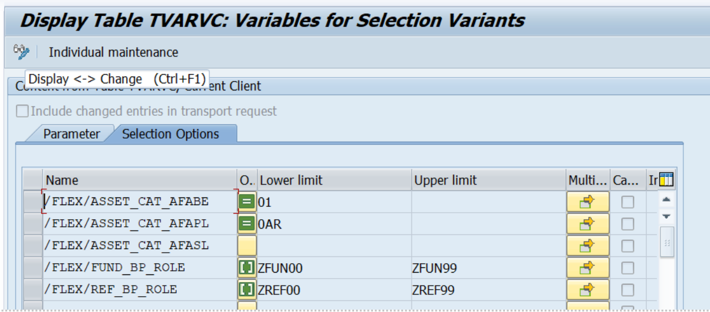
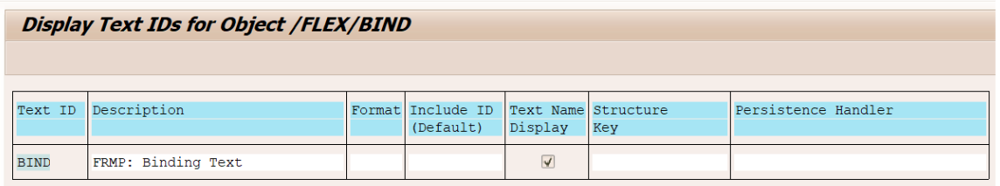
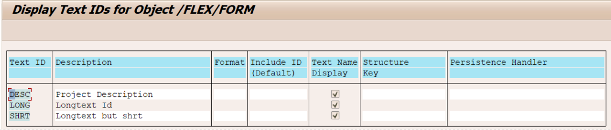
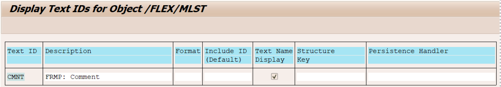
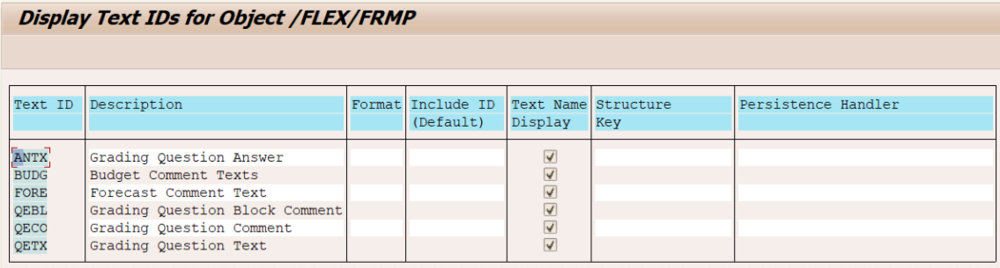

(The error when saving the application was due to empty table DEMO_EXPRESSIONS.  
A table entry is created by running program /FLEX/DEMO_EXPRESSIONS.
Should have been added as part of the cut-over actions.)

(/FLEX/DEMO_CALL_FNDR_PRGRM 

Execute this program if calls aren’t linked to a program/funder. This program will fill /RPM/BUCKET_D-/FLEX/FUNDER and /RPM/BUCKET_D-/FLEX/PROGRAM )

## Parameters and Selection Options(Tcode STVARV)

Note: make sure that the inclusion/exclusion signes are the same!

## Text Objects and Text IDs (Tcode SE75)

Add the following text objects and text IDs.

Text object /FLEX/BIND 
 

Text object /FLEX/FORM --> Text IDs are custom specific (see [creating long texts](../Form%20Configurator/Components/Long%20Text%20Configurator/Long%20Text%20Configurator.md))

 
Text object /FLEX/FRMP

 
Text object /FLEX/MLST

 