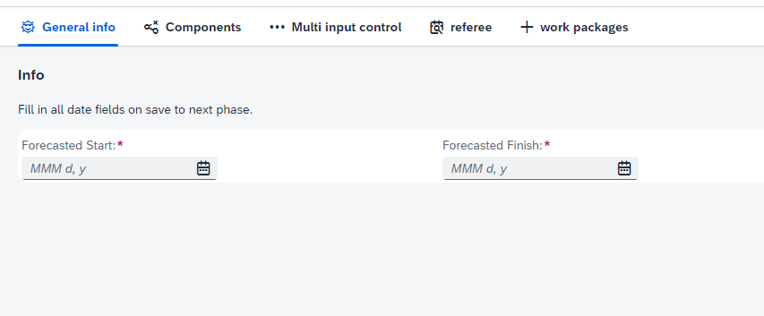

## Binding text

This feature enables the display of the discriptive text that has been entered in the Form configurator.

## Default header

This feature enables the display of the default header for all applications.

<!--  -->

Image is WIP
