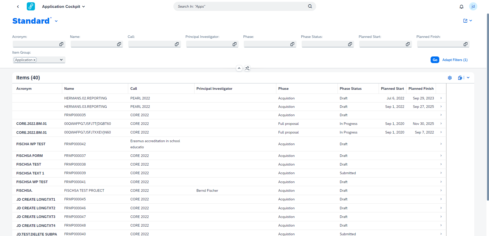

## Item Cockpit

With the Item Cockpit, the end user gets an overview of all items - these being either applications, awards or projects - in a robust cockpit. Here they can follow up on their items and immediately navigate to all apps they might need for that item in that specific moment in its lifecycle.

The Item Cockpit was made with extensibility in mind and is one of the reccuring apps through which you can guide your project from initial approval to final closing.

&nbsp;

