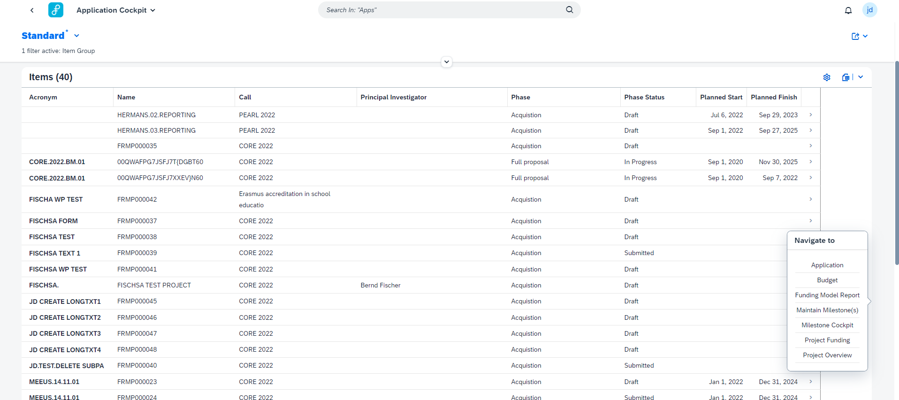
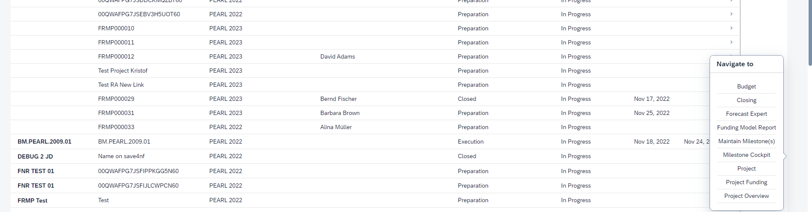
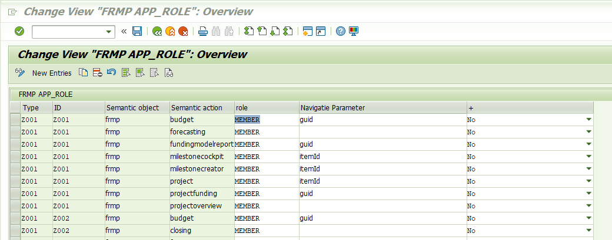
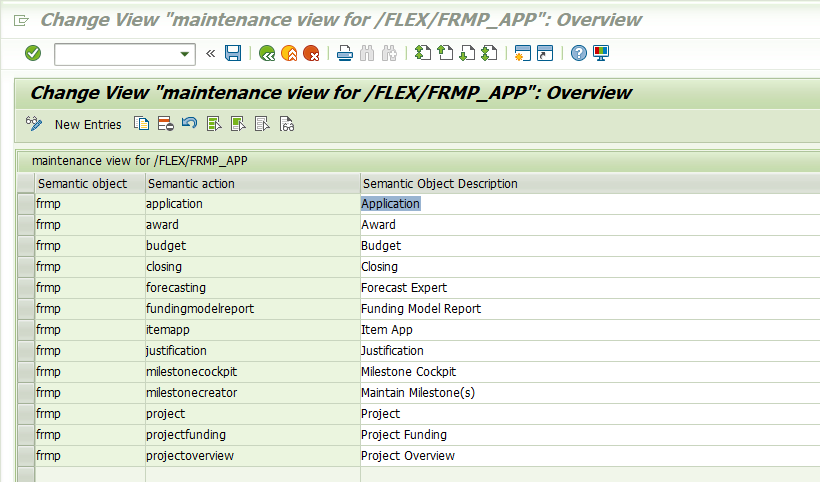
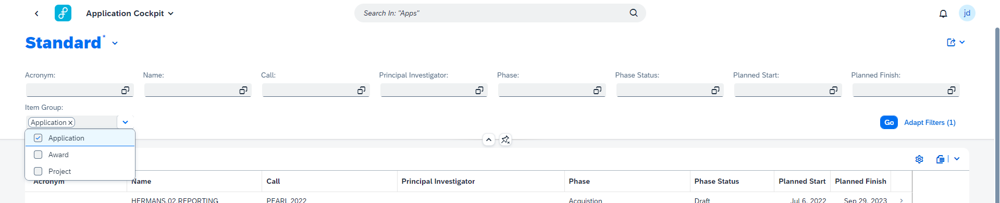
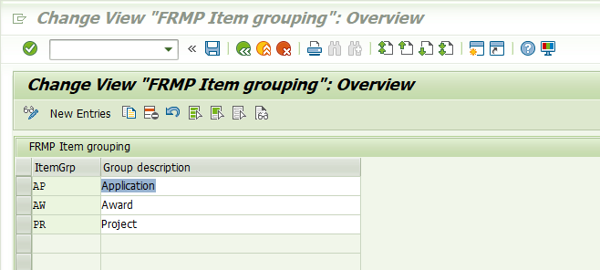
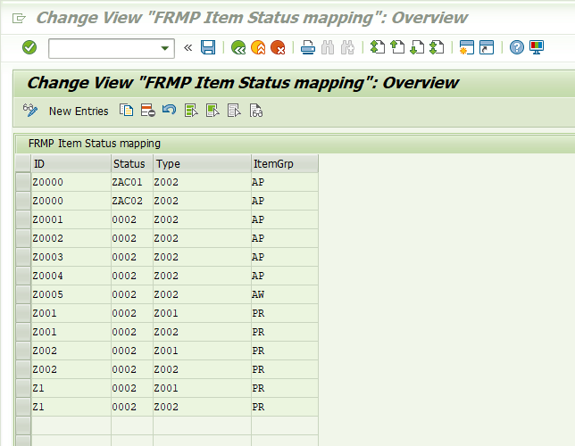

# Overview of Items / Research Projects

The Item Cockpit provides an overview of items / Research Projects. It is the central cockpit from where a user can navigate to the different apps.

Different filters are available to easily find an Item / Research Project.

&nbsp;

&nbsp;

# App Navigation

When selecting an item from the list, a popup containing a list of all apps where can be navigated to, opens. By clicking on one of those options, navigation to the selected app will occure. This with the app already configured to have the relevant item selected.

&nbsp;

&nbsp;

The apps where can be navigated to are depend on the Items / Research Projects phase in its lifecycle.

&nbsp;

&nbsp;

It's also only possible to navigate to the Application/Project app (also known as the Item App) when a form has been provided for that point in the lifecycle of the Item / Research Project.

&nbsp;

# App Navigation Configuration
## Functional Configuration
App navigation is determined by the itemType, decission id and role. The "Yes", "No" field indicates if the application is active or not (displayed/hidden for the user). To indicate what app can be opened in what phase in its lifecyle navigate to: SPRO -> Flexso Research Management -> Item Cockpit -> "Determine the app navigation options based on the item type & decission id".

The semantic object, semantic action and navigation parameter are configured by a technical consultant.

&nbsp;

&nbsp;

## Technical Configuration
The Semantic object, Semantic action and Navigation parameter configuration correspond to the semantic object/action and navigation property used in the front end. These properties are configured: SPRO -> Flexso Research Management -> Item Cockpit -> "Determine semantic objects and translate them"

&nbsp;

&nbsp;

# Reusable Fiori Tiles

A key user possessing all access roles will see an Application Cockpit, Award Cockpit and Project Cockpit in the fiori launchpad. All three of these redirect to the Item Cockpit. The key difference between them is that - on opening - their item group is already filtered on the relevant property.

If a user wants to undo this, change the filtered item group or wants to create combinations of certain item groups, they can do this with the Item Group filter property.

If this property is not showing - which is possible after a reload of the page since the user has unsaved filter configuration - they will have to manually add the filter property by clicking on the "Adapt Filters" button in the right bottom corner of the header.

&nbsp;

&nbsp;

## Item Group Configuration
To determine the different item groups, navigate to: SPRO -> Flexso Research Management -> Item Cockpit -> "Determine the item groups and translate them". Here you enter a 2 char long key and the translation of the item group.

&nbsp;

&nbsp;

To determine the item grouping of an item / research project based on the decission id, status and item type, navigate to: SPRO -> Flexso Research Management -> Item Cockpit -> "Determine the item grouping based on the item type & decission id"

&nbsp;

&nbsp;