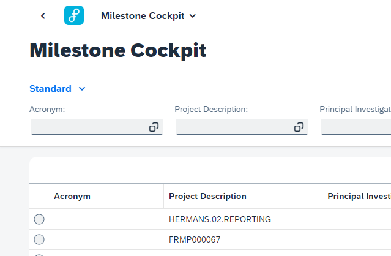
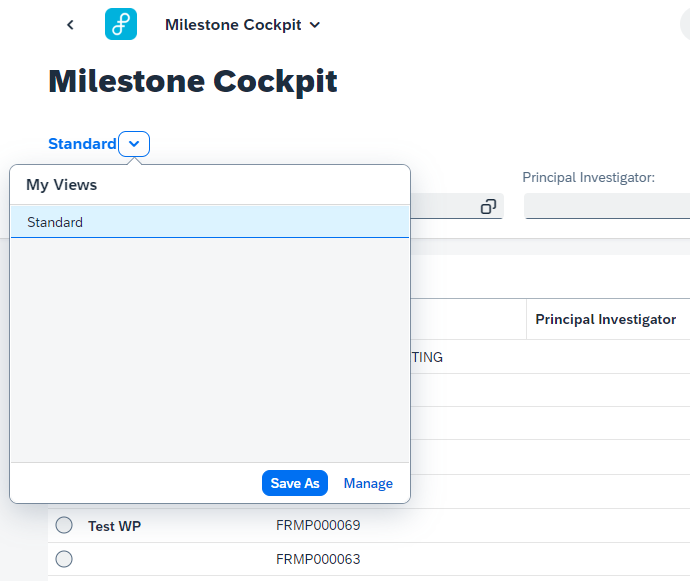
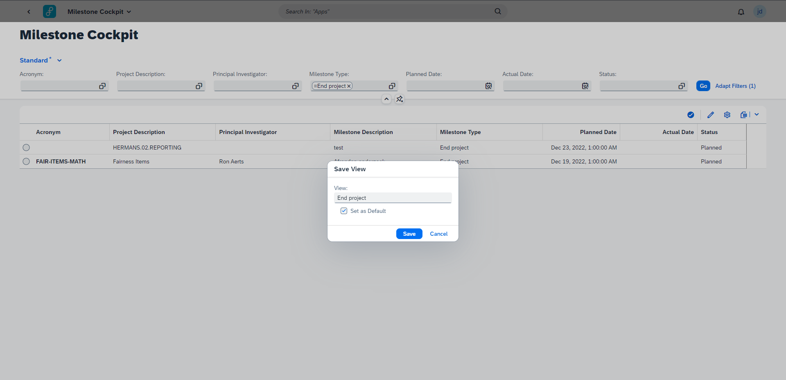

# Variant Management

Variant Management makes it possible to save a filter configuration as a variant. This variant can be set as default filter configuration when opening the Milestone Cockpit.

&nbsp;

&nbsp;

Key users can save their preferred filter configuration thanks to the Variant Management tool. When changes have been made to any of the display configurations an asterix appears in the top left corner to indicate that changes have been made.

&nbsp;

&nbsp;

Subsequently you can open the dropdown of the 'View name' where you can choose to save the changed configuration. When saving you can assign it a name as well as declare it as default view.
Once saved the view can be accessed and selected in exactly the same way - whether you have changes or not.
The current view name is always shown in the top left corner, the default being 'Standard'.

&nbsp;

&nbsp;

Likewise it is also possible to manage any created views with the 'Manage' button. Manage options include picking favorites, setting as default, applying the view automatically as well as deleting the view.
Take note that it is not possible to delete the Standard view.

&nbsp;

## Using Variant Management

To use Variant Management go to:
SPRO -> Flexso Research Management -> Features -> "Maintain Package Feature Status per Application"

Check or uncheck the checkbox for frmp milestonecockpit variantManagement.

&nbsp;

**WORK IN PROGRESS**
