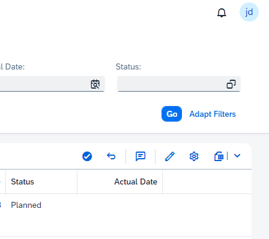

# Milestone cockpit

## Maintain a milestone

To maintain a milestone, select the milestone in the table and click the edit icon on the top right corner of the table. Navigation to the Milestone maintainer app will take place where a milestone can be maintained.

## Register milestone as complete

To register a milestone as complete, select the milestone in the table and click the “Register as Complete” button (check icon). The status of the selected milestone will change to “Completed”. Note that you can now no longer change the milestone in the Milestone Maintainer app.

## Register a milestone as incomplete

To register a milestone as incomplete, select the milestone in the table and click the "Register as Incomplete" button (return icon). The status of the selected mileston will change to the corresponding status.

## Add Comment

To register a comment for a milestone, select the milestone in the table and click the "Maintain comment" button (comment icon). A text editor popup will open where a text can be entered. When clicking save, the comment will be saved.

&nbsp;

&nbsp;
