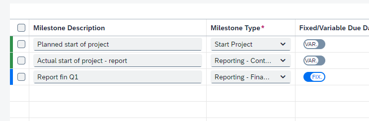
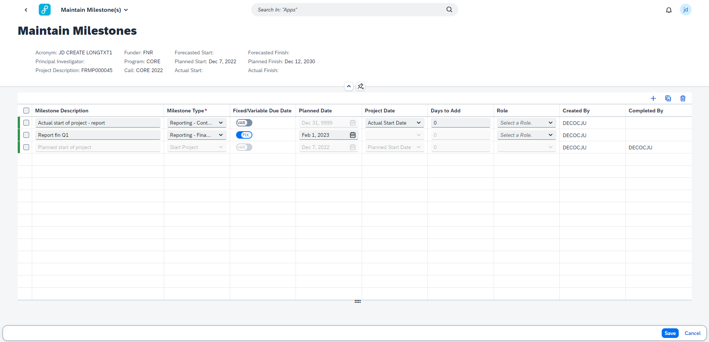
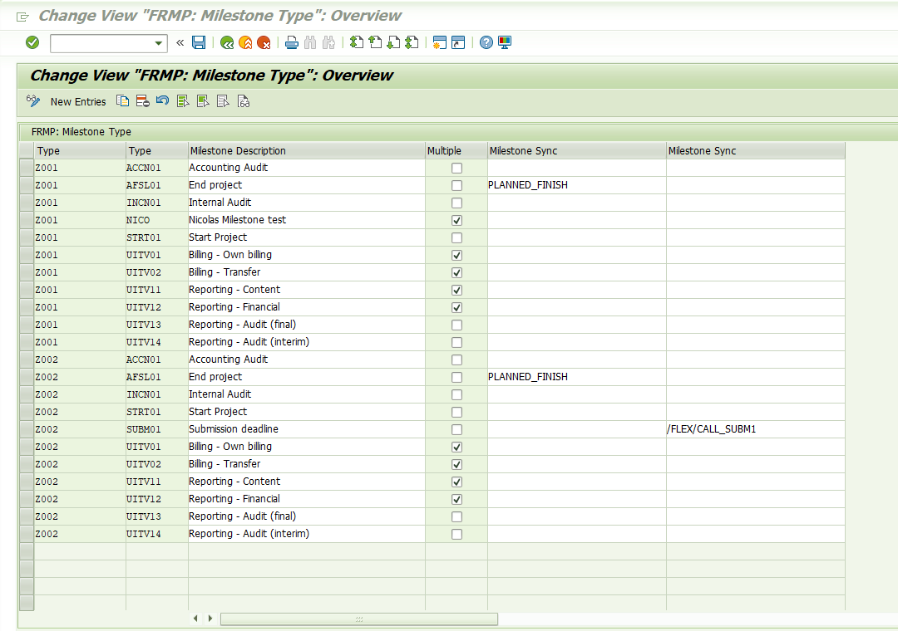

# Create and Maintain Milestones
## Create Milestones

To create new milestones for an item / Research Project you open the Maintain Milestones application from the Item Cockpit (Application/Award/Project). 

To add a new milestone, click the Add button on the top right of the table.
Fixed milestone, is a milestone based on a fixed date that you select in the date picker field. A variable milestone, is a milestone on which the date is based on the selected project date that can be selected from the dropdown. If the project date is not yet filled in, ‘31/12/9999’ will be displayed as end date.

&nbsp;

&nbsp;

A saved milestone is highlighted in green, a new milestone that has not yet been saved is highlighted in blue.

&nbsp;

&nbsp;

## Maintain Milestones
To maintain a milestone op the Maintain Milestones application from the Item Cockpit (Application/Award/Project). All existing milestones will be displayed and can be edited. 
A milestone that has been completed cannot be changed.

&nbsp;

&nbsp;

# Functional Configuration
To configure what Milestone Type can be selected navigate to: SPRO -> Flexso Research Management -> Milestones -> “Determine the milestones based on the item type”
Here milestone types can be configured based for each item type. 

&nbsp;

&nbsp;

