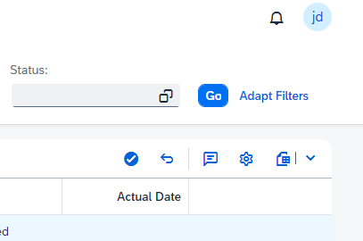

# My milestone cockpit

## Register milestone as complete

To register a milestone as complete, select the milestone in the table and click the “Register as Complete” button (check icon). The status of the selected milestone will change to “Completed”.

## Register a milestone as incomplete

To register a milestone as incomplete, select the milestone in the table and click the "Register as Incomplete" button (return icon). The status of the selected mileston will change to the corresponding status.

## Add Comment

To register a comment for a milestone, select the milestone in the table and click the "Maintain comment" button (comment icon). A text editor popup will open where a text can be entered. When clicking save, the comment will be saved.

&nbsp;

&nbsp;
