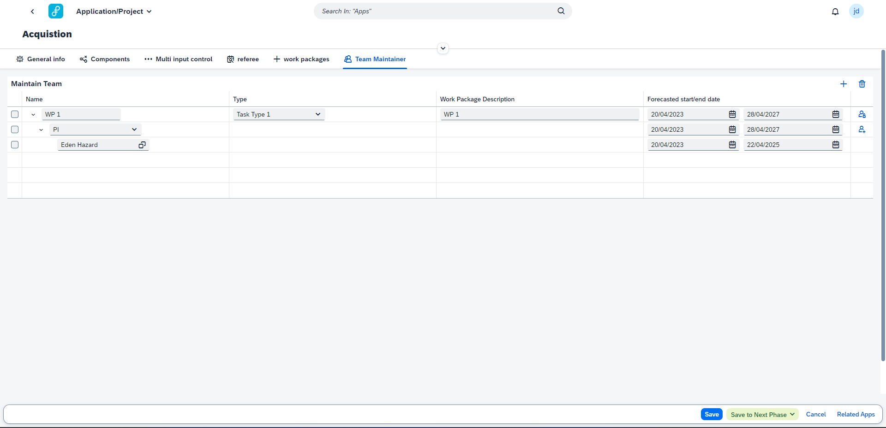

# Team maintainer

In the Team maintainer you can create work packages/tasks for a project. Multiple work packages can be created for a project.

A role can be added to a work packages. For this role you have to indicate what role it is and what the start/end date is. Multiple roles can be added to a work package.

An employee can be added to a role. A business partner has to be selected from the value help dialog, and indicate what the start/end for the employee is. Multiple employees can be added to a role.

Example of a work package with the PI role assigned and an employee assigned to the role:

&nbsp;
