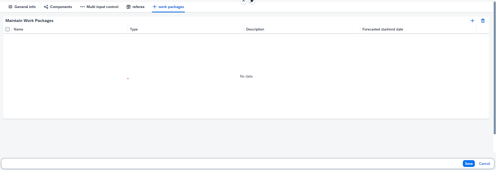

## Work Package Maintainer

The Work packages maintainer is a component to manage different work packages and sub work packages. The Work packages maintainer component cannot be configured. This means the component can only be added once to a form.

Work packages maintainer in the Item app:

&nbsp;

## Workpackage maintainer

The Workpackage maintainer is an application where new workpackages (ppm tasks) and subpackages can be created, updated and deleted.

To navigate to this application open the Application/Award/Project cockpit, select the ppm item for which you want to add workpackages and select "Workpackage maintainer" in the popover. The Workpackage maintainer will now open for the selected ppm item.
