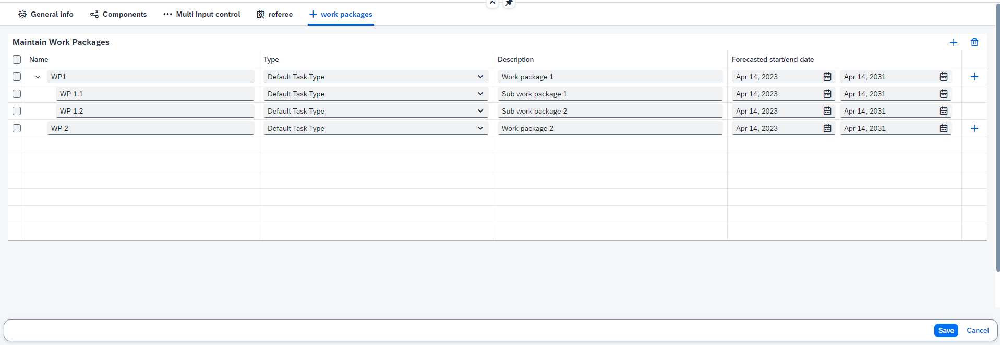

# Work packages maintainer

In the Work packages maintainer you can create different work packages or tasks for a project. A work package has a name, type of work package, a description and a start/end date. A work package will be saved as a task in ppm.

It is also possible to add a sub work package to a work package. For this work package the same properties can be entered as for the main work package.

Example of a work package with 2 sub work packages and a work package with no sub work packages:

&nbsp;
